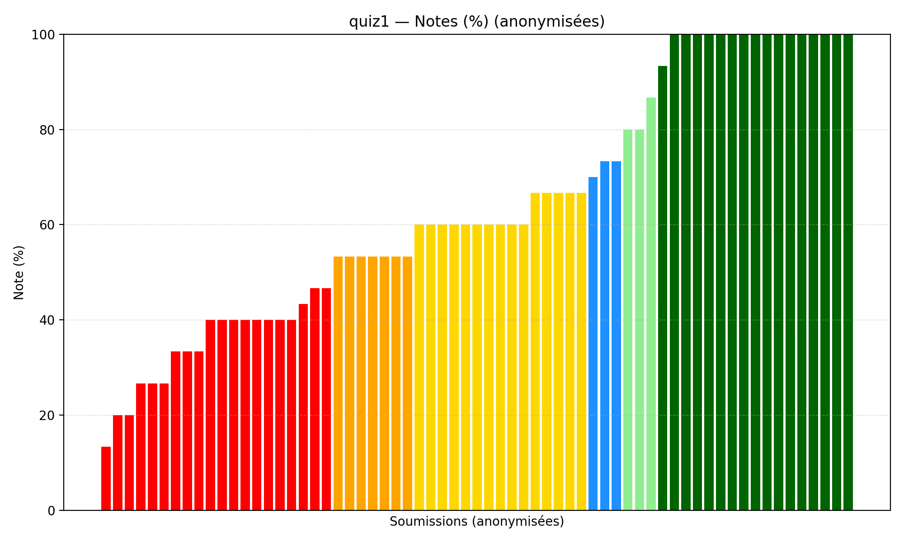
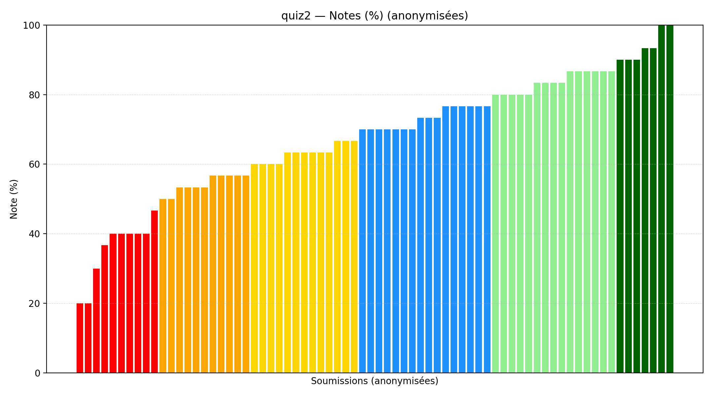
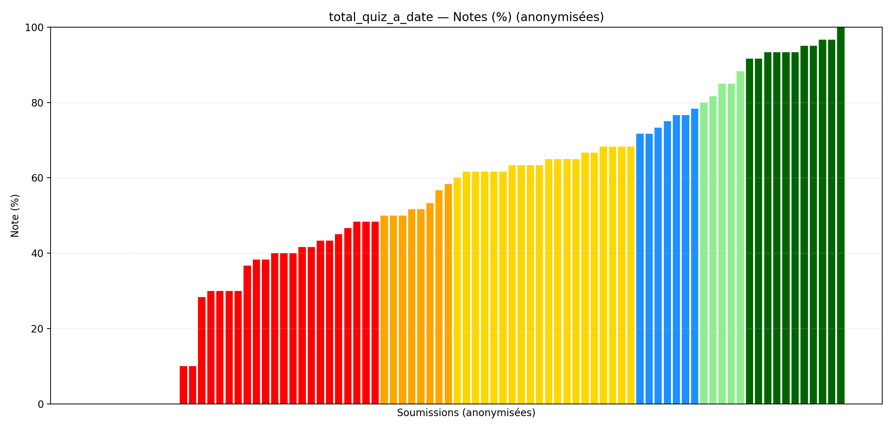

# :material-checkbox-marked-circle: Corrections

Cette section contient les corrigés des quiz et examens du cours.

---

## Quiz

### Quiz 1

[:material-file-pdf-box: Télécharger le corrigé](files/quiz/IFT2015_Quiz_01_Corrige.pdf){ .md-button }

=== "Sans valeurs manquantes"

    | Stats | Valeur |
    |---|---:|
    | N | 65 |
    | Moyenne | 63.90 |
    | Médiane | 60.00 |
    | Min | 13.33 |
    | Max | 100.00 |

=== "Avec valeurs manquantes (comptées comme 0)"

    | Stats | Valeur |
    |---|---:|
    | N | 83 |
    | Moyenne | 50.04 |
    | Médiane | 53.33 |
    | Min | 0.00 |
    | Max | 100.00 |

---

### Quiz 2

[:material-file-pdf-box: Télécharger le corrigé](files/quiz/IFT2015_Quiz_02_Corrige.pdf){ .md-button }

=== "Sans valeurs manquantes"

    | Stats | Valeur |
    |---|---:|
    | N | 72 |
    | Moyenne | 67.36 |
    | Médiane | 70.00 |
    | Min | 20.00 |
    | Max | 100.00 |

=== "Avec valeurs manquantes (comptées comme 0)"

    | Stats | Valeur |
    |---|---:|
    | N | 83 |
    | Moyenne | 58.43 |
    | Médiane | 63.33 |
    | Min | 0.00 |
    | Max | 100.00 |

---

### Total des quiz à date

=== "Sans valeurs manquantes"

    | Stats | Valeur |
    |---|---:|
    | N | 83 |
    | Moyenne | 54.24 |
    | Médiane | 61.67 |
    | Min | 0.00 |
    | Max | 100.00 |

=== "Avec valeurs manquantes (comptées comme 0)"

    | Stats | Valeur |
    |---|---:|
    | N | 83 |
    | Moyenne | 54.24 |
    | Médiane | 61.67 |
    | Min | 0.00 |
    | Max | 100.00 |

