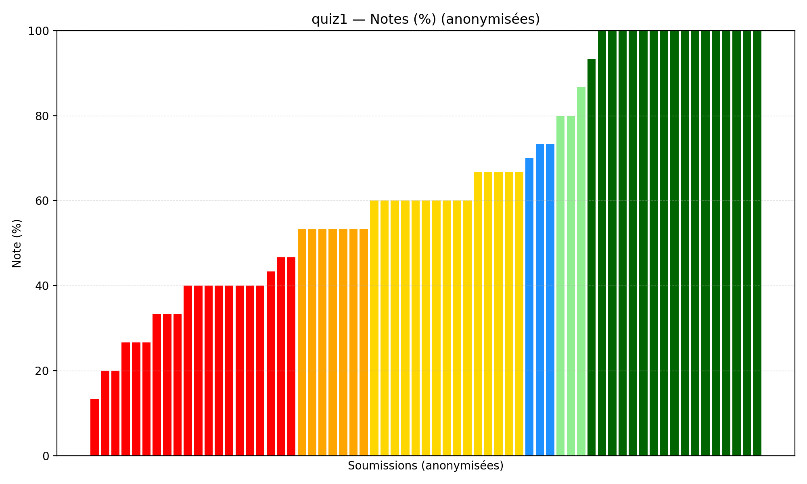
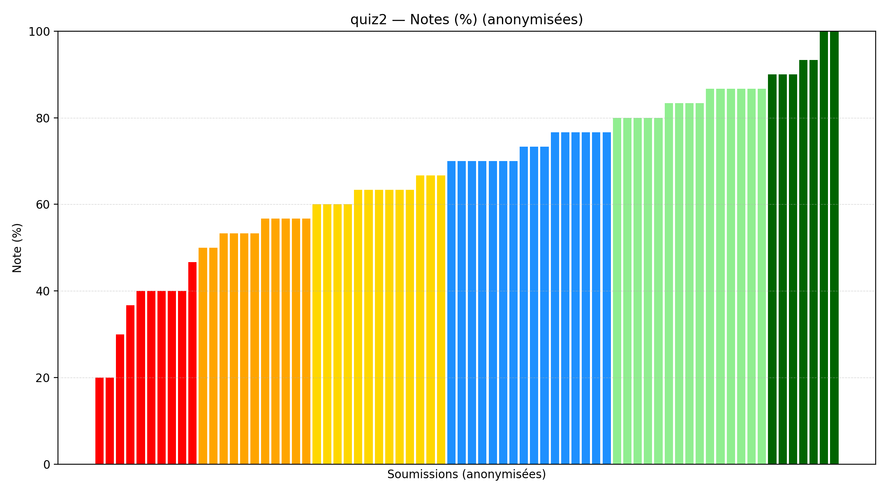
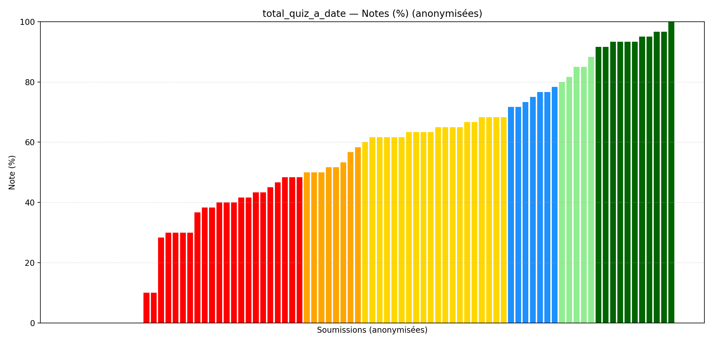

# :material-checkbox-marked-circle: 答案

本部分包含测验和考试的答案。

---

## 测验

### 测验 1

[:material-file-pdf-box: 下载答案](files/quiz/IFT2015_Quiz_01_Corrige.pdf){ .md-button }

=== "无缺失值"

    | 统计 | 数值 |
    |---|---:|
    | N | 65 |
    | 平均值 | 63.90 |
    | 中位数 | 60.00 |
    | 最小值 | 13.33 |
    | 最大值 | 100.00 |

=== "含缺失值（计为0）"

    | 统计 | 数值 |
    |---|---:|
    | N | 83 |
    | 平均值 | 50.04 |
    | 中位数 | 53.33 |
    | 最小值 | 0.00 |
    | 最大值 | 100.00 |

---

### 测验 2

[:material-file-pdf-box: 下载答案](files/quiz/IFT2015_Quiz_02_Corrige.pdf){ .md-button }

=== "无缺失值"

    | 统计 | 数值 |
    |---|---:|
    | N | 72 |
    | 平均值 | 67.36 |
    | 中位数 | 70.00 |
    | 最小值 | 20.00 |
    | 最大值 | 100.00 |

=== "含缺失值（计为0）"

    | 统计 | 数值 |
    |---|---:|
    | N | 83 |
    | 平均值 | 58.43 |
    | 中位数 | 63.33 |
    | 最小值 | 0.00 |
    | 最大值 | 100.00 |

---

### 测验累计总分

=== "无缺失值"

    | 统计 | 数值 |
    |---|---:|
    | N | 83 |
    | 平均值 | 54.24 |
    | 中位数 | 61.67 |
    | 最小值 | 0.00 |
    | 最大值 | 100.00 |

=== "含缺失值（计为0）"

    | 统计 | 数值 |
    |---|---:|
    | N | 83 |
    | 平均值 | 54.24 |
    | 中位数 | 61.67 |
    | 最小值 | 0.00 |
    | 最大值 | 100.00 |

